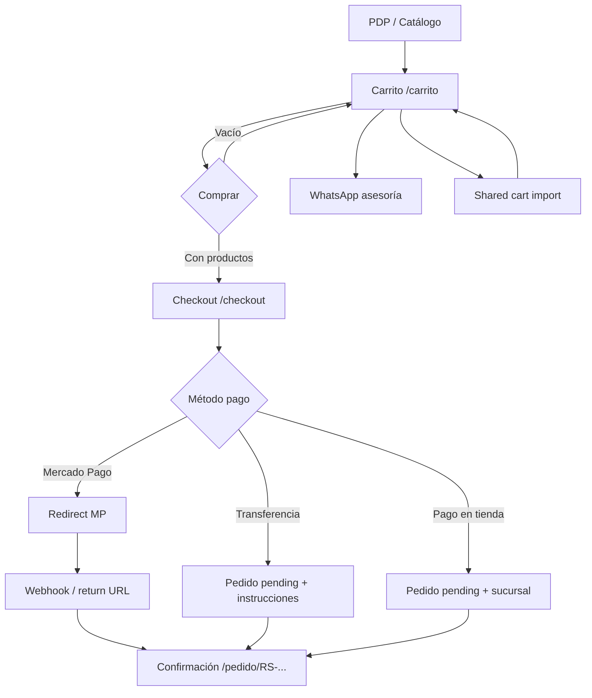

# ORDER-2.5 — Arquitectura de Experiencia de Checkout · Radio Shalko

**Fase:** ORDER-2.5 (análisis, arquitectura UX y flujos únicamente)  
**Fecha:** Junio 2026  
**Estado:** Documento de diseño — sin implementación  
**Prerequisitos:** ORDER-1 (`ORDER_ARCHITECTURE_RADIO_SHALKO.md`), ORDER-2 (tablas `orders`, `order_items`, `customer_addresses`, `order_status_history`)

---

## Resumen ejecutivo

Radio Shalko debe adoptar un checkout de **una sola página con secciones progresivas** (variante optimizada de la Opción A), no un wizard de múltiples rutas. Es el patrón de Shopify Plus y el más adecuado para tickets medios-altos en instrumentos musicales, donde el cliente necesita ver el total y las líneas mientras completa contacto, entrega y pago.

La estrategia de clientes es **invitado por defecto + cuenta opcional** (Google post-compra). La entrega se adapta por modalidad con campos mínimos. Los pagos se presentan con **Mercado Pago recomendado**, transferencia y pago en tienda como fallback — sin implementar pasarelas en esta fase.

Este documento es la guía para **ORDER-3** (UI) y **ORDER-4** (`createOrderFromCart()`).

---

## 1. Auditoría del carrito actual

### 1.1 Drawer lateral (`header.tsx`)

| Elemento | Existe hoy | Reutilizable en checkout |
|----------|------------|--------------------------|
| Lista compacta de productos (imagen, marca, nombre, qty, subtotal) | ✅ | Patrón visual del resumen lateral |
| Total dominante (`text-3xl`) | ✅ | Mismo peso tipográfico en checkout |
| Cantidad editable (`QuantityStepper`) | ✅ | Solo en `/carrito`; en checkout **solo lectura** |
| CTA cliente: Solicitar asesoría | ✅ | Mantener en carrito; no en checkout |
| CTA admin: Compartir carrito | ✅ | Solo carrito; no checkout |
| CTA secundario: Ver carrito | ✅ | Drawer → página completa |
| Link: Seguir explorando | ✅ | Checkout: "Volver al carrito" |

**Información que ya existe:** `productId`, cantidad, precio vivo del catálogo, imagen, marca, nombre.

**Información que falta para comprar:** contacto, método de entrega, sucursal o dirección, método de pago, aceptación de términos (opcional v1), precio congelado.

### 1.2 Página `/carrito` (`cotizacion-page.tsx`)

| Elemento | Existe hoy | Notas |
|----------|------------|-------|
| Layout dos columnas (productos + resumen) | ✅ | **Plantilla directa para checkout** |
| Tabla desktop / filas móvil | ✅ | Checkout reutiliza columna derecha |
| Resumen con total `text-4xl` | ✅ | Mismo componente mental |
| Botón Comprar | ⚠️ Deshabilitado | Habilitar → navegar a `/checkout` |
| Solicitar asesoría | ✅ | Permanece en carrito |
| Barra fija móvil (total + CTA) | ✅ | En checkout: "Continuar" o "Pagar" |
| `isAdmin` / Compartir | ✅ | Admin no usa checkout para ventas asistidas en v1 |

**Datos del carrito (`useQuote`):** `ids`, cantidades por producto, persistencia Supabase (auth) o localStorage (invitado).

**Gap crítico:** `quote_items.unit_price` no se escribe. El snapshot ocurre al **iniciar checkout** o al **confirmar pedido** (ORDER-4).

### 1.3 Shared carts (`/carrito/s/[token]`)

| Elemento | Existe hoy | Relación con checkout |
|----------|------------|----------------------|
| Precios congelados en BD | ✅ | Mismo principio que `order_items` |
| Importar a carrito del usuario | ✅ | Flujo: share → carrito → checkout |
| Sin checkout directo desde share | ❌ | v1: importar primero; v2 opcional: checkout desde token |
| Metadata POS (`sale_label`, `branch_name`) | ✅ | No copiar a checkout cliente; admin puede crear pedido manual |

### 1.4 Matriz reutilización → checkout

| Activo actual | Reutilizar | Adaptar |
|---------------|------------|---------|
| `QuoteProvider` / `useQuote` | Leer líneas al entrar a checkout | No mutar durante checkout |
| `fetchProductsByIds` | Hidratar productos + validar publicados | + validar stock informativo |
| `formatPrice` | Totales y resumen | + shipping_cost |
| Layout resumen UX-1 | Columna derecha sticky | Añadir desglose envío |
| `branches` (BD) | Selector pickup | Unificar con `SITE_CONTACT` en UI |
| `customer_addresses` (ORDER-2) | Persistir al confirmar | Formulario condicional |
| `orders` schema | Destino final | `createOrderFromCart()` en ORDER-4 |

### 1.5 Información faltante (resumen)

```
PARA COMPRAR SE NECESITA:
├── Cliente: nombre, email, teléfono
├── Entrega: método + (sucursal | dirección)
├── Pago: método seleccionado
├── Legales: términos (opcional v1)
└── Snapshot: líneas con precio congelado al confirmar
```

---

## 2. Diseño del flujo — Opción A vs Opción B

### 2.1 Opción A — Carrito → Checkout → Confirmación

```
/carrito  →  /checkout  →  /pedido/[order_number]
   │              │                    │
 editar      una página           solo lectura
 productos   secciones            + siguiente paso
```

**Ventajas:** Menos clics, total siempre visible, menor abandono, alineado con Shopify One-Page Checkout.

**Desventajas:** Página más larga en móvil (mitigable con acordeón).

### 2.2 Opción B — Wizard multi-paso

```
/carrito → /checkout/datos → /checkout/entrega → /checkout/pago → /confirmacion
```

**Ventajas:** Cada paso es simple; familiar en algunos marketplaces antiguos.

**Desventajas:** 4 navegaciones, pérdida de contexto del carrito, back button confuso, más abandono en móvil.

### 2.3 Decisión recomendada: **Opción A+ (One-Page Checkout)**

Radio Shalko debe implementar **una ruta `/checkout`** con secciones verticales colapsables en móvil y visibles en desktop:

```
┌─────────────────────────────────────────────────────────────┐
│  CHECKOUT                                    [Volver carrito]│
├──────────────────────────────┬──────────────────────────────┤
│  1. Contacto                 │  RESUMEN (sticky)            │
│  2. Entrega                  │  · líneas (solo lectura)     │
│  3. Pago                     │  · subtotal                  │
│  4. [Confirmar pedido]       │  · envío                     │
│                              │  · TOTAL                     │
└──────────────────────────────┴──────────────────────────────┘
```

**Justificación para tienda de instrumentos:**

1. **Ticket alto** — el cliente quiere ver el total mientras decide entrega y pago.
2. **Confianza local** — muchos compradores alternan entre online y visita a tienda; un flujo corto no compite con WhatsApp.
3. **Catálogo ya maduro** — el carrito UX-1 ya tiene el layout de dos columnas; checkout es extensión natural.
4. **Shopify Plus / Thomann** — checkout de una página con resumen lateral es estándar en retail musical premium.
5. **Mercado Libre** — usa pasos en app, pero para tienda propia de marca el one-page convierte mejor.

**Excepción:** Si el método de pago es Mercado Pago, el usuario **sale** a MP y **regresa** a `/pedido/[número]` — eso no convierte el checkout en wizard interno.

### 2.4 Diagrama de flujo completo



---

## 3. Estrategia de clientes

### 3.1 Comparativa

| Modelo | Abandono | Instrumentos musicales | Shopify | Mercado Libre |
|--------|----------|------------------------|---------|---------------|
| **Solo invitado** | Más bajo al inicio | Sin historial; soporte por teléfono | Shop Pay acelera repetición | Compra sin cuenta común |
| **Solo cuenta** | Más alto | Fricción innecesaria | Desaconsejado como única vía | Obliga cuenta en muchos flujos |
| **Ambas (recomendado)** | Óptimo | Mejor equilibrio | Checkout invitado + opción crear cuenta | Invitado + login opcional |

### 3.2 Recomendación Radio Shalko

**Invitado por defecto. Cuenta opcional.**

| Momento | Comportamiento |
|---------|----------------|
| Entrar a checkout | Sin login obligatorio |
| Sesión Google activa | Pre-llenar email y nombre desde `profiles` |
| Post-confirmación | Banner: "Guarda tu pedido — inicia sesión con Google" |
| `/cuenta/pedidos` | Solo usuarios con `user_id` en pedido |

**¿Por qué menos abandono?** En México, ~60–70% de abandonos ocurren en registro forzado (benchmark ecommerce LATAM). Radio Shalko ya tiene Google OAuth de baja fricción; usarlo como **opción**, no como barrera.

**¿Por qué conviene en instrumentos?** Compra consultiva, tickets altos, relación humana (tienda física, WhatsApp). El teléfono es más crítico que la cuenta.

### 3.3 Vinculación invitado → cuenta (ORDER-7)

- Pedido con `user_id = null` + email coincidente al hacer login → ofrecer vincular.
- No automático sin consentimiento.

---

## 4. Información del cliente

### 4.1 Campos — clasificación

| Campo | Obligatorio | Cuándo | Almacenamiento |
|-------|-------------|--------|----------------|
| **Nombre completo** | ✅ | Siempre | `orders.customer_name` |
| **Correo electrónico** | ✅ | Siempre | `orders.customer_email` |
| **Teléfono (WhatsApp)** | ✅ | Siempre | `orders.customer_phone` |
| **Notas del pedido** | Opcional | Siempre | `orders.notes` |
| RFC / factura | ❌ v1 | — | Fuera de checkout |
| Empresa | ❌ v1 | — | — |
| Contraseña | ❌ | — | Solo Google OAuth |

### 4.2 Validación mínima

- Email: formato válido.
- Teléfono: 10 dígitos MX (normalizar espacios/guiones).
- Nombre: mínimo 2 caracteres.

### 4.3 Pre-llenado

| Fuente | Campos |
|--------|--------|
| `profiles` (Google) | email, full_name |
| Último pedido del usuario | teléfono, nombre si difiere |
| localStorage (invitado) | contacto de checkout anterior (opcional, ORDER-3) |

### 4.4 Anti-patrones (evitar)

- Pedir dirección antes de elegir método de entrega.
- Pedir datos de facturación por defecto.
- Dos campos de email.
- CAPTCHA en v1.

---

## 5. Estrategia de entrega

### 5.1 Modalidades (mapeo a ORDER-2)

| UX | `delivery_method` | `branch_id` | `customer_addresses` |
|----|-------------------|-------------|----------------------|
| Recoger en tienda | `pickup` | ✅ requerido | ❌ no |
| Entrega local | `local_delivery` | opcional (hub) | ✅ `type: shipping` |
| Envío nacional | `national_shipping` | ❌ | ✅ `type: shipping` |

### 5.2 UX — Recoger en tienda

```
┌─────────────────────────────────────┐
│ ○ Recoger en tienda          $0     │
│   ┌─────────────┐ ┌─────────────┐   │
│   │ Valle Chalco│ │  Amecameca  │   │
│   └─────────────┘ └─────────────┘   │
│   Horario: Lun–Sáb 10:00–20:00      │
│   Listo. Sin más campos.            │
└─────────────────────────────────────┘
```

**Campos:** solo selector de sucursal (`branches.id`).  
**`shipping_cost`:** 0.  
**`fulfillment_status` inicial:** `unfulfilled` → admin → `ready_for_pickup`.

### 5.3 UX — Entrega local

Zona: Valle de Chalco, Chalco, Ixtapaluca, Amecameca y alrededores (definir CP en ORDER-6).

```
┌─────────────────────────────────────┐
│ ○ Entrega local              $99*   │
│   Calle          [____________]     │
│   No. exterior   [____]  Int. [__]  │
│   Colonia        [____________]     │
│   CP             [_____]            │
│   Referencias    [____________]     │
│   * o "Costo por confirmar"         │
└─────────────────────────────────────┘
```

**Campos obligatorios:** `street`, `exterior_number`, `neighborhood`, `postal_code`, `city` (default o inferido), `state` (default Edo. Méx.).

**Opcionales:** `interior_number`, `references_note`.

**Nombre/teléfono en dirección:** copiar de contacto (no duplicar en UI; persistir en `customer_addresses` al guardar).

### 5.4 UX — Envío nacional

```
┌─────────────────────────────────────┐
│ ○ Envío a domicilio nacional  $199* │
│   (mismos campos que local +        │
│    Estado [dropdown]  Ciudad)       │
└─────────────────────────────────────┘
```

**Campos obligatorios:** todos los de `customer_addresses` excepto `interior_number` y `references_note`.

**Costo v1:** tarifa fija por método o "Se confirma por asesor" (`shipping_cost = 0`, nota en confirmación).

### 5.5 Selector de método (orden recomendado en UI)

1. **Recoger en tienda** — default sugerido (cero fricción, alinea con negocio físico).
2. **Entrega local**
3. **Envío nacional**

### 5.6 Stock informativo (v1)

- En checkout, mostrar badge "Disponible en Chalco" si hay stock (sin bloquear compra en ORDER-3/4).
- ORDER-4+: validación dura opcional.

---

## 6. Estrategia de pagos (solo UX)

### 6.1 Orden de presentación

| Prioridad | Método | Rol | Implementación |
|-----------|--------|-----|----------------|
| 1 | **Mercado Pago** | Recomendado · badge "Pago seguro" | ORDER-6 |
| 2 | **Transferencia bancaria** | Fallback digital | ORDER-4 (manual) |
| 3 | **Pago en tienda** | Fallback local / pickup | ORDER-4 (manual) |

### 6.2 UX por método

#### Mercado Pago (recomendado)

```
┌─────────────────────────────────────┐
│ ● Mercado Pago  [Recomendado]       │
│   Tarjeta · SPEI · OXXO · MSI       │
│   [ Confirmar y pagar ]             │
└─────────────────────────────────────┘
```

- Al confirmar: crear pedido `pending` → redirect MP → return → `payment_status: paid` vía webhook.
- MSI: destacar para totales > $3,000 MXN.

#### Transferencia bancaria

```
┌─────────────────────────────────────┐
│ ○ Transferencia bancaria            │
│   Banco · CLABE · Referencia        │
│   "Sube comprobante" (ORDER-6+)     │
│   Pedido queda pendiente de pago    │
└─────────────────────────────────────┘
```

- `payment_status: pending` hasta que admin confirme.
- Instrucciones en página de confirmación.

#### Pago en tienda

```
┌─────────────────────────────────────┐
│ ○ Pago al recoger en tienda         │
│   Ideal si elegiste recoger         │
│   Reservamos tu pedido 48h          │
└─────────────────────────────────────┘
```

- Solo habilitado si `delivery_method = pickup` (o siempre con copy de reserva).
- `payment_status: unpaid` → admin confirma al cobrar.

### 6.3 Qué NO mostrar en v1

- Stripe, PayPal, Apple Pay (fase posterior).
- Múltiples tarjetas guardadas.
- Split payment.

---

## 7. Pantallas — estructura

### 7.1 `/checkout` — Checkout

**Ruta:** `src/app/(site)/checkout/page.tsx` (ORDER-3)

| Zona | Contenido |
|------|-----------|
| Header | "Checkout" · link Volver al carrito |
| Col izquierda | Secciones 1–3 (formularios) |
| Col derecha sticky | Resumen de pedido (solo lectura) |
| Móvil | Resumen colapsable arriba; CTA fijo abajo |

**Secciones:**

1. **Contacto** — nombre, email, teléfono, notas opcionales.
2. **Entrega** — radio métodos + campos condicionales.
3. **Pago** — radio métodos + copy contextual.
4. **CTA principal** — "Confirmar pedido" / "Pagar con Mercado Pago".

**Estados vacíos:** si carrito vacío → redirect `/carrito`.

**Admin:** mismo checkout en v1 (no flujo separado); herramientas de venta siguen en carrito vía share.

### 7.2 Resumen lateral (componente compartido)

```
Resumen del pedido
──────────────────
[Foto] Producto A    ×2    $7,800
[Foto] Producto B    ×1    $5,800
──────────────────
Subtotal              $13,600
Envío                 $0 / $99 / Por confirmar
──────────────────
TOTAL                 $13,600
```

- Sin edición de cantidad (volver al carrito para cambios).
- Precios: vivos hasta confirmar; congelar en ORDER-4 al crear pedido.

### 7.3 `/pedido/[order_number]` — Confirmación / Pedido recibido

**Acceso:** post-checkout; token en query para invitados (`?t=...`) en ORDER-4.

| Bloque | Contenido |
|--------|-----------|
| Hero | "Pedido recibido" + `RS-2026-00042` |
| Estado | Pendiente de pago / Confirmado |
| Resumen líneas | Snapshot `order_items` |
| Entrega | Método + sucursal o dirección |
| Pago | Instrucciones según método |
| CTA | Volver al catálogo · Contactar WhatsApp |
| Opcional | "Crear cuenta para ver tus pedidos" |

### 7.4 `/cuenta/pedidos` — Mis pedidos (ORDER-7)

| Elemento | Detalle |
|----------|---------|
| Lista | Número, fecha, total, estado, badge pago |
| Filtro | Todos / pendientes / completados |
| Detalle | Link a `/pedido/[order_number]` |
| Vacío | "Aún no tienes pedidos" + ir al catálogo |

### 7.5 `/cuenta/pedidos/[order_number]` — Detalle cliente

- Misma información que confirmación + timeline `order_status_history`.

### 7.6 Wireframe textual — Desktop checkout

```
┌────────────────────────────────────────────────────────────────┐
│ ← Volver al carrito          RADIO SHALKO                      │
├────────────────────────────────────┬───────────────────────────┤
│                                    │                           │
│  1. CONTACTO                       │  TU PEDIDO                │
│  Nombre [________________]         │  ─────────────────        │
│  Email  [________________]         │  Item 1         $7,800    │
│  Tel    [________________]         │  Item 2         $5,800    │
│                                    │  ─────────────────        │
│  2. ENTREGA                        │  Subtotal      $13,600    │
│  (•) Recoger  ( ) Local  ( ) Nac.  │  Envío              $0    │
│  [Chalco] [Amecameca]              │  TOTAL         $13,600    │
│                                    │                           │
│  3. PAGO                           │                           │
│  (•) Mercado Pago                  │                           │
│  ( ) Transferencia                 │                           │
│  ( ) Pago en tienda                │                           │
│                                    │                           │
│  [      Confirmar pedido       ]   │                           │
│                                    │                           │
└────────────────────────────────────┴───────────────────────────┘
```

---

## 8. Panel administrativo — llegada del pedido

### 8.1 Flujo operativo

```
Pedido creado (status: pending)
        ↓
   [Pago confirmado]
        ↓
status: confirmed · payment_status: paid
fulfillment_status: unfulfilled
        ↓
Admin: preparando
        ↓
fulfillment_status: preparing
        ↓
    ┌───┴───┐
 pickup   envío
    ↓       ↓
ready_   shipped
pickup      ↓
    ↓    delivered
entregado en tienda
    ↓
status: completed
```

### 8.2 Vista `/admin/pedidos` (ORDER-5)

| Columna | Fuente |
|---------|--------|
| Número | `order_number` |
| Fecha | `created_at` |
| Cliente | `customer_name` + teléfono |
| Total | `total` |
| Estado | `status` + badges `payment_status`, `fulfillment_status` |
| Entrega | `delivery_method` + sucursal |

**Filtros:** pendientes de pago, por confirmar envío, listos para recoger.

### 8.3 Detalle admin

- Líneas `order_items` (snapshot).
- Dirección `customer_addresses` si aplica.
- Timeline `order_status_history`.
- Notas cliente + notas admin (`orders.notes` + campo futuro `admin_note`).
- Acciones: cambiar estado, confirmar pago manual, cancelar.

### 8.4 Automático vs manual

| Acción | Automático | Manual (admin) |
|--------|------------|----------------|
| Crear pedido | Sistema (ORDER-4) | — |
| `payment_status: paid` | Webhook MP (ORDER-6) | Transferencia, tienda |
| `status: confirmed` | Al pagar | Transferencia pendiente |
| `fulfillment_status` | — | Admin |
| `status: completed` | Opcional al `delivered` | Admin |
| Email confirmación | ORDER-6+ | — |
| Decremento inventario | ORDER-4+ (opcional) | — |

### 8.5 Notificaciones (diseño, no implementar)

| Evento | Canal |
|--------|-------|
| Pedido nuevo | Email admin / dashboard badge |
| Pago recibido | Cliente email + WhatsApp opcional |
| Listo para recoger | Cliente SMS/WhatsApp |
| Enviado | Cliente con tracking |

---

## 9. Riesgos

| Riesgo | Mitigación |
|--------|------------|
| Checkout largo | One-page; campos condicionales; pickup default |
| Abandono en pago MP | Return URL clara; pedido `pending` recuperable |
| Pedido invitado perdido | Email + link con token en confirmación |
| Precio cambia mid-checkout | Congelar al submit en ORDER-4 |
| Sobreventa | Validación stock ORDER-4; reservas ORDER-6 |
| `shipping_cost` incierto | Copy "por confirmar"; admin ajusta antes de confirmar |
| RLS insert solo admin | Función `security definer` o política checkout en ORDER-4 |
| Confusión carrito vs pedido | Copy claro; vaciar carrito post-compra |
| Admin usa checkout | Permitido; no bloquear |

---

## 10. Roadmap

### ORDER-3 — Checkout UI

| Entregable | Detalle |
|------------|---------|
| Ruta `/checkout` | Formularios contacto + entrega + pago |
| Habilitar "Comprar" en `/carrito` | Link a checkout |
| Resumen lateral | Solo lectura, reutilizar layout UX-1 |
| Validación cliente | Zod + estados de error |
| Sin crear pedido aún | Submit → toast "Próximamente" o mock |

**Depende de:** ORDER-2 (schema)  
**Riesgo:** Scope UI — no llamar API de pedido todavía

### ORDER-4 — Creación de pedidos

| Entregable | Detalle |
|------------|---------|
| `createOrderFromCart()` | Server Action |
| Generación `order_number` | `RS-YYYY-NNNNN` |
| Snapshot `order_items` | Título, SKU, marca, precios |
| `customer_addresses` | Si aplica |
| `order_status_history` | Entrada inicial |
| RLS insert | Política o función segura |
| Redirect | `/pedido/[order_number]` |
| Vaciar carrito | Post-éxito |

**Depende de:** ORDER-3  
**Riesgo:** Transaccionalidad — usar RPC o transacción SQL

### ORDER-5 — Panel pedidos

| Entregable | Detalle |
|------------|---------|
| `/admin/pedidos` | Lista + detalle + cambio estados |
| Quitar `soon` del sidebar | — |

**Depende de:** ORDER-4  
**Riesgo:** Estados inconsistentes — validar transiciones

### ORDER-6 — Mercado Pago

| Entregable | Detalle |
|------------|---------|
| Preferencias MP | Redirect |
| Webhooks | `payment_status` |
| Transferencia UX | Instrucciones + cola admin |

**Depende de:** ORDER-4  
**Riesgo:** Webhooks idempotentes

### ORDER-7 — Historial cliente

| Entregable | Detalle |
|------------|---------|
| `/cuenta/pedidos` | Lista + detalle |
| Vinculación invitado | Post-login |

**Depende de:** ORDER-4, ORDER-5  
**Riesgo:** Pedidos `user_id` null

### ORDER-8 — Reportes

| Entregable | Detalle |
|------------|---------|
| `/admin/reportes` | Ventas por período, sucursal, producto |
| Export CSV | — |
| KPIs en dashboard | — |

**Depende de:** ORDER-5, volumen de pedidos  
**Riesgo:** Scope creep

### Diagrama de dependencias

```
ORDER-2.5 (este doc)
    └── ORDER-3 Checkout UI
            └── ORDER-4 createOrderFromCart
                    ├── ORDER-5 Admin pedidos
                    ├── ORDER-6 Mercado Pago
                    └── ORDER-7 Historial cliente
                            └── ORDER-8 Reportes
```

### Criterios de éxito ORDER-3

- [ ] Usuario llega de `/carrito` con productos
- [ ] Completa contacto + entrega + pago en una página
- [ ] Ve total actualizado con envío
- [ ] Mobile usable (barra fija, sin scroll infinito)
- [ ] `npm run build` exit 0
- [ ] Sin crear pedidos reales hasta ORDER-4

---

## 11. Contrato ORDER-3 → ORDER-4 (handoff)

Para que ORDER-3 no bloquee ORDER-4, la UI debe producir este payload (tipado en ORDER-3, persistido en ORDER-4):

```typescript
type CheckoutPayload = {
  contact: {
    name: string;
    email: string;
    phone: string;
    notes?: string;
  };
  delivery: {
    method: "pickup" | "local_delivery" | "national_shipping";
    branchId?: string; // pickup
    address?: {
      type: "shipping";
      street: string;
      exteriorNumber: string;
      interiorNumber?: string;
      neighborhood: string;
      city: string;
      state: string;
      postalCode: string;
      country?: string;
      referencesNote?: string;
    };
  };
  payment: {
    method: "mercado_pago" | "bank_transfer" | "pay_in_store";
  };
  // líneas: leídas del carrito en servidor, no del cliente
};
```

**Regla de seguridad:** Nunca confiar en precios del cliente; recalcular en servidor desde catálogo al crear pedido.

---

## 12. Glosario checkout

| Término | Definición |
|---------|------------|
| **Checkout** | Proceso de cierre entre carrito y pedido |
| **Invitado** | Compra sin `user_id`; identificado por email/teléfono |
| **Snapshot** | Precio y nombre congelados en `order_items` |
| **Pending** | Pedido creado, pago no confirmado |
| **Confirmado** | Pago validado o aprobado manualmente |

---

*Documento generado en fase ORDER-2.5. No modifica código, Supabase ni componentes. Base para ORDER-3.*
