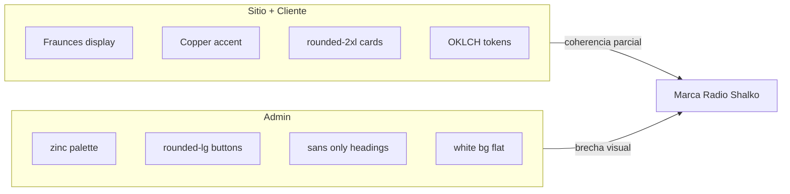

# DESIGN-1 — Auditoría visual global · Radio Shalko WEB

**Proyecto:** Radio Shalko WEB (independiente — no SEEDIS)  
**Fase:** DESIGN-1 · Diagnóstico (sin implementación)  
**Fecha:** 2026-06-22  
**Base:** revisión de código + tokens en `globals.css` + patrones en componentes clave  
**Sales OS v1:** sin cambios funcionales en esta fase

---

## 1. Resumen ejecutivo

Radio Shalko WEB tiene **dos lenguajes visuales paralelos**:

| Superficie | Sensación actual | Potencial |
|------------|------------------|-----------|
| **Sitio público + cliente** | Editorial cálido (Fraunces + copper + fondos claros) | Premium musical, confiable |
| **Admin** | Panel SaaS genérico (`zinc-*`, bordes grises, sans plano) | Funcional pero **no se siente de la misma marca** |

El flujo Sales OS está validado en staging; el problema principal ya no es funcional sino **refinamiento visual**: tipografía inconsistente, escala de títulos variable, CTAs con formas distintas (`rounded-full` vs `rounded-md` vs `rounded-lg`), y densidad/spacing que cambia entre rutas similares.

**Veredicto:** base de marca existe (copper, serif display, imágenes hero fuertes), pero falta un **sistema de diseño unificado** aplicado con disciplina en cliente, checkout y admin.

**DESIGN-2** debe implementar tokens + componentes compartidos, no un rediseño desde cero.

---

## 2. Estado visual actual

### Fortalezas

- Paleta base en OKLCH con acento **copper** definido (`globals.css`).
- Tipografía de marca: **Inter** (cuerpo) + **Fraunces** (`font-display`) — adecuada para retail musical premium.
- Home con hero fullscreen, categorías visuales, carrusel de marcas — sensación aspiracional.
- Flujo cliente (cuenta, pedidos, notificaciones) usa cards suaves `rounded-2xl`, buen contraste legible.
- Estados de pedido con badges semánticos (pending, paid, ready).
- Header rico (búsqueda, mega menú, drawers) — nivel producto real.

### Debilidades

- **Admin desconectado:** ~40+ archivos admin usan `text-zinc-*` / `border-zinc-*` en lugar de tokens `--foreground`, `--border`, `--copper`.
- **Escala tipográfica ad hoc:** mismos roles (H1 página) van de `text-2xl` a `text-5xl` según archivo.
- **Botones fragmentados:** shadcn `Button` (`rounded-md`) convive con CTAs custom `rounded-full` copper/foreground sin variante única.
- **Totales/precios:** algunos ya pulidos (carrito SALES-7.2.1), otros aún grandes (`shared-cart-page` `text-3xl/4xl`).
- **Densidad admin:** tablas y formularios CRUD densos, poco aire; sensación “herramienta interna” vs “Radio Shalko”.
- **Copy visual:** mezcla de tono editorial (home) y copy utilitario genérico (admin, empty states).

---

## 3. Diagnóstico general



**Causa raíz:** evolución por fases (catálogo → Sales OS → admin CRUD) sin capa de design system compartida. Cada fase resolvió UI localmente.

**Riesgo si no se corrige:** cada pantalla nueva amplía la inconsistencia; la marca se percibe “funcional pero genérica” fuera del home.

---

## 4. Problemas principales por prioridad

| Prioridad | Problema | Impacto |
|-----------|----------|---------|
| **P0** | Admin vs sitio no comparten tokens ni tipografía display | Marca rota en operación diaria |
| **P0** | Escala H1/H2/precio inconsistente entre páginas | Jerarquía confusa, sensación amateur |
| **P1** | CTAs con 3 radios distintos (md / lg / full) | UI “pegada”, no sistemática |
| **P1** | Badges/estados duplicados (admin vs cliente) | Misma info, distinto look |
| **P2** | Spacing vertical irregular (`pt-28`, `mt-10`, `mt-8` mezclados) | Ritmo visual irregular |
| **P2** | Admin mobile no optimizado (sidebar fijo desktop) | Operación en tablet/móvil incómoda |
| **P3** | Header ~1500 líneas, muchos patrones inline | Mantenimiento y consistencia difíciles |
| **P3** | Algunos empty states genéricos | Poco humano / poco marca |

---

## 5. Auditoría por pantalla

Leyenda: ✅ Bien · ⚠️ Mejorable · ❌ Prioridad DESIGN-2

### Sitio público

| Pantalla | Tipografía | Espaciado | Componentes | Jerarquía | Mobile | Notas |
|----------|------------|-----------|-------------|-----------|--------|-------|
| **Home** | ⚠️ Hero 4xl→7xl uppercase fuerte; resto OK | ✅ | ✅ Hero, categorías | ✅ Hero domina | ✅ | Mejor página de marca |
| **Header** | ⚠️ Muchos tamaños en drawers | ⚠️ Complejo | ⚠️ Mega menú + 3 sheets | ⚠️ Muchos focos | ⚠️ Denso | Refactor visual, no funcional |
| **Hero** | ✅ Editorial | ✅ | ✅ | ✅ | ✅ | Referencia de tono |
| **Categorías / destacados** | ✅ | ✅ | ✅ Cards | ✅ | ✅ | Coherente con catálogo |
| **Productos** | ⚠️ H1 3xl→4xl | ✅ | ✅ Filtros sheet | ✅ | ✅ | Filtros mobile OK |
| **Detalle producto** | ⚠️ Precio 2xl display | ✅ | ✅ Gallery | ✅ | ✅ | CTA copper + stepper |
| **Marcas** | ⚠️ H1/H2 variados | ✅ | ✅ | ✅ | ✅ | |
| **Servicios** | ⚠️ H3 3xl→4xl repetitivo | ⚠️ Secciones largas | ✅ | ⚠️ Muchos bloques similares | ✅ | Simplificar jerarquía |
| **Contacto** | ⚠️ | ✅ | ✅ Cards tienda | ✅ | ✅ | |
| **Garantía** | ⚠️ H1 4xl→5xl | ✅ | ✅ | ✅ | ✅ | |
| **Footer** | ✅ Display logo | ✅ | ✅ | ✅ | ✅ | Oscuro, contraste OK |

### Flujo cliente

| Pantalla | Tipografía | Espaciado | Componentes | Jerarquía | Mobile | Notas |
|----------|------------|-----------|-------------|-----------|--------|-------|
| **Login** | ✅ Contenido | ✅ Centrado | ✅ Google CTA | ✅ | ✅ | Simple, poco marca |
| **Cuenta** | ✅ 2xl→3xl | ✅ Secciones | ✅ Activity cards | ✅ | ✅ | Sin direcciones OK |
| **Notificaciones** | ✅ | ✅ | ✅ Lista | ✅ | ✅ | |
| **Mis pedidos** | ✅ | ✅ pt-28 | ✅ Cards | ✅ | ✅ | |
| **Detalle pedido** | ⚠️ Total 2xl | ✅ | ✅ Secciones estado | ✅ CTA pago claro | ✅ | Muchas secciones apiladas |
| **Favoritos** | ⚠️ H1 hasta 5xl | ✅ | ✅ Grid producto | ✅ | ✅ | H1 más grande que cuenta |
| **Carrito** | ⚠️ H1 hasta 4xl; total 2xl/3xl OK | ✅ | ✅ Summary | ✅ | ✅ Sticky bar | Mejorado SALES-7.2.1 |
| **Checkout** | ⚠️ Varios tamaños display | ⚠️ pb-40 mobile | ✅ Form + summary | ✅ | ⚠️ Barra fija | Confirmación OK |
| **Carrito compartido** | ❌ Total 3xl/4xl | ✅ | ✅ | ❌ Total domina | ✅ | Quick win DESIGN-2 |

### Flujo admin

| Pantalla | Tipografía | Espaciado | Componentes | Jerarquía | Mobile | Notas |
|----------|------------|-----------|-------------|-----------|--------|-------|
| **Dashboard** | ❌ Sans plano, no display | ✅ | ⚠️ Stats 3xl | ✅ | ⚠️ | Muy genérico |
| **Sidebar** | ⚠️ zinc labels | ✅ | ✅ Nav groups | ✅ | ❌ Desktop-first | Badge pedidos OK |
| **Pedidos lista** | ⚠️ zinc | ⚠️ Denso | ✅ Filtros, cards | ✅ | ⚠️ | Funcional |
| **Detalle pedido** | ⚠️ mono order # | ✅ | ✅ Secciones | ✅ | ⚠️ Largo scroll | Flujo Sales claro |
| **Revisión disponibilidad** | ⚠️ | ✅ | ✅ Radios | ✅ | ✅ | Nota interna oculta OK |
| **Pago / fulfillment** | ⚠️ | ✅ | ✅ Botones zinc-900 | ✅ | ✅ | |
| **Productos / CRUD** | ⚠️ | ❌ Tablas densas | ⚠️ Muchos inputs | ⚠️ | ❌ | Mayor esfuerzo DESIGN-2 |
| **Categorías / marcas** | ⚠️ | ❌ | ⚠️ | ⚠️ | ❌ | Similar products-manager |
| **Inventario** | ⚠️ | ❌ | ⚠️ Tabla + badges stock | ⚠️ | ❌ | Fuera Sales OS pero visible |
| **Carrito tienda** | ✅ Reusa sitio | ✅ | ✅ Share | ✅ | ✅ | Coherente con cliente |

---

## 6. Auditoría de tipografía

### Sistema actual (`globals.css`)

| Token | Fuente | Uso |
|-------|--------|-----|
| Body | Inter 300–700 | Texto general |
| `font-display` | Fraunces (optical sizing) | Títulos, precios, nombres producto |
| Pesos display | 400 default utility; componentes usan medium/semibold | Inconsistente |

### Problemas detectados

1. **H1 de página** — al menos 6 escalas distintas:
   - Cuenta/pedidos: `text-2xl md:text-3xl`
   - Catálogo/contacto: `text-3xl md:text-4xl`
   - Favoritos/garantía: hasta `text-5xl`
   - Hero home: `text-4xl md:text-6xl lg:text-7xl uppercase`

2. **Precios** — `font-display` en cards (`text-base`→`text-lg`), detalle (`text-2xl`), carrito (`text-2xl/3xl`), shared cart (`text-3xl/4xl`).

3. **Admin** — casi todo `text-sm` / `text-2xl font-semibold` sans; **no usa Fraunces** → ruptura de marca.

4. **Labels** — mezcla de `text-xs uppercase tracking-wider`, `text-[11px] tracking-[0.18em]`, `text-[10px]` en carrito.

5. **font-weight** — `font-medium`, `font-semibold`, `font-light` en display sin regla clara.

### Sensación

- **Sitio:** entre premium editorial y plantilla e-commerce (por inconsistencia).
- **Admin:** plantilla dashboard genérica (Notion/Linear-like pero sin polish).

---

## 7. Auditoría de espaciado

### Patrones recurrentes (sitio)

| Patrón | Uso | Observación |
|--------|-----|-------------|
| `px-5 md:px-8` | Páginas cuenta | Consistente |
| `pt-28 pb-28` | Offset header fijo | Repetido en cuenta/pedidos |
| `py-20 md:py-24` | Carrito, checkout | Similar |
| `mt-10` secciones cuenta | Actividad, perfil | OK |
| `gap-4` / `gap-8` grids | Cards | OK |

### Patrones admin

| Patrón | Uso | Observación |
|--------|-----|-------------|
| `p-8` layout main | Todo admin | Plano, poco max-width en detalle pedido |
| `max-w-5xl` | Solo dashboard | Otras páginas full width |
| `p-5` cards | Secciones pedido | Consistente entre sí |
| Tablas `px-4 py-3` | CRUD | Denso |

### Problemas

- Ritmo vertical **no tokenizado** (magic numbers `mt-6`, `mt-8`, `mt-10`).
- Cliente account vs checkout vs carrito: mismo rol, distinto padding top.
- Admin listas vs formularios: saltos de densidad bruscos.

---

## 8. Auditoría de componentes

| Componente | Sitio cliente | Admin | Consistencia |
|------------|---------------|-------|--------------|
| **Botón primario** | `rounded-full` copper / foreground | `rounded-lg` zinc-900 | ❌ |
| **Botón secundario** | outline / border | border zinc-200 | ⚠️ |
| **Card** | `rounded-2xl border-border bg-card/60` | `rounded-xl border-zinc-200 bg-white` | ❌ |
| **Badge estado** | `customer-status-labels` | `status-labels` (zinc/emerald) | ⚠️ Duplicado |
| **Input** | shadcn Input | native + zinc borders | ⚠️ |
| **Empty state** | dashed border, icon muted | zinc icons | ⚠️ |
| **Sheet/Drawer** | header display | — | ✅ Sitio |
| **Table** | — | products/inventory | ❌ Denso |

**Button (`ui/button.tsx`):** shadcn default `rounded-md` — **poco usado** en flujos principales; CTAs custom dominan.

---

## 9. Auditoría de jerarquía visual

### Demasiada atención

- Hero home (correcto).
- Totales grandes en shared cart y algunos resúmenes.
- Stats dashboard admin (`text-3xl`).
- Barra móvil checkout/carrito compitiendo con contenido.

### Poca atención

- Subtítulos de sección admin (todo `text-sm text-zinc-500`).
- Pasos del flujo pedido admin (muchas cajas mismo peso visual).
- Mensaje para cliente vs metadata pedido (mismo card weight).

### CTAs

- Cliente: “Pagar ahora” (foreground filled) — correcto.
- Cliente: “Solicitar asesoría” (copper) — correcto.
- Admin: todos zinc-900 — funcional pero no marca.
- Múltiples botones mismo peso en detalle pedido (WhatsApp + acciones).

---

## 10. Auditoría mobile

| Área | Estado | Notas |
|------|--------|-------|
| Header móvil | ⚠️ | Menú extenso, hamburger + sheets; usable pero pesado |
| Carrito móvil | ✅ | Sticky total + CTA |
| Checkout móvil | ⚠️ | `pb-40`, summary arriba parcial |
| Cuenta / pedidos | ✅ | Cards stack OK |
| Product grid | ✅ | 1–2 cols |
| Admin sidebar | ❌ | `w-60` fijo; sin drawer mobile evidente |
| Admin tablas | ❌ | Scroll horizontal probable en productos/inventario |
| Touch targets | ✅ | Botones ~h-10/h-11 en flujos cliente |

---

## 11. Auditoría admin (transversal)

**Funcional:** Sales OS claro (disponibilidad → pago → fulfillment).

**Visual:**

- Paleta **zinc** aislada del copper cálido del sitio.
- Tipografía **100% sans** — pierde identidad Radio Shalko.
- Componentes CRUD (productos, categorías, inventario) parecen **módulo aparte** vs pedidos.
- POS vendedor (`seller-pos.tsx`) aún más denso.

**Recomendación DESIGN-2:** sub-brand admin — mismo copper como acento, fondos neutros cálidos (no zinc frío), Fraunces solo en títulos de página admin.

---

## 12. Auditoría cliente (transversal)

**Funcional:** Separación roles OK post STAGING-3.

**Visual:**

- Mejor cohesión que admin (tokens OKLCH, cards redondeadas).
- Oportunidad: unificar **page shell** (título + descripción + padding) en cuenta, pedidos, notificaciones, favoritos.
- Detalle pedido: muchas secciones — considerar **timeline vertical** en DESIGN-2 para jerarquía.
- Login: minimalista — añadir sutil marca (logo + una línea editorial).

---

## 13. Recomendaciones de sistema de diseño

### Principios propuestos

1. **Una marca, dos densidades** — sitio aireado; admin compacto pero mismos tokens.
2. **Fraunces solo para display** — títulos, precios destacados, logo text; nunca párrafos largos.
3. **Inter para UI** — forms, tablas, body, labels.
4. **Copper = acción comercial** — CTA cliente; acento admin (links, badges activos).
5. **Foreground near-black = acción crítica** — pagar, confirmar admin.

### Estructura DESIGN-2

```
src/styles/tokens.css (o ampliar globals.css)
src/components/ui/  → unificar Button, Badge, Card, PageHeader, SectionLabel
src/components/layout/page-shell.tsx  → cliente
src/components/admin/admin-page-shell.tsx  → admin
```

---

## 14. Tokens sugeridos

### Tipografía

| Rol | Mobile | Desktop | Fuente | Peso |
|-----|--------|---------|--------|------|
| Display XL (hero) | 2.25rem | 3.75rem | Fraunces | 400–500 |
| Page title (H1) | 1.5rem | 1.875rem | Fraunces | 600 |
| Section title (H2) | 1.125rem | 1.25rem | Fraunces | 600 |
| Body | 0.875rem | 1rem | Inter | 400 |
| Body small | 0.8125rem | 0.875rem | Inter | 400 |
| Label caps | 0.6875rem | 0.75rem | Inter | 600, tracking 0.12em |
| Price hero | 1.5rem | 1.875rem | Fraunces | 600 |
| Price inline | 1rem | 1.125rem | Fraunces | 600 |

### Espaciado (escala 4px)

| Token | Valor | Uso |
|-------|-------|-----|
| `--space-page-x` | 1.25rem / 2rem md | Padding horizontal |
| `--space-page-top` | 7rem | Offset header fijo |
| `--space-section` | 2.5rem | Entre secciones |
| `--space-card` | 1.25rem | Padding card |
| `--space-stack-sm` | 0.75rem | Entre label e input |

### Radios

| Token | Valor | Uso |
|-------|-------|-----|
| `--radius-button` | 9999px (full) | CTAs cliente |
| `--radius-button-admin` | 0.5rem | CTAs admin |
| `--radius-card` | 1rem | Cards cliente |
| `--radius-card-admin` | 0.75rem | Cards admin |
| `--radius-input` | 0.5rem | Inputs |

### Sombras

| Token | Uso |
|-------|-----|
| `--shadow-card` | `0 12px 40px -24px rgba(0,0,0,0.12)` | Resumen carrito (ya existe similar) |
| `--shadow-header` | sutil sticky header | Header site |
| Admin | preferir **bordes** sobre sombras fuertes | |

### Bordes

- Cliente: `border-border` (oklch 10% opacity)
- Admin: migrar `border-zinc-200` → `border-border` o `--admin-border`

### Colores

Mantener tokens actuales; añadir:

| Token | Uso |
|-------|-----|
| `--admin-surface` | Fondo admin ligeramente cálido (no blanco puro) |
| `--admin-muted` | Reemplazo zinc-50 |
| `--status-success` | emerald existente |
| `--status-warning` | amber suave |
| `--status-neutral` | muted |

---

## 15. Quick wins (DESIGN-2 fase 1)

Priorizados por impacto / esfuerzo:

| # | Cambio | Esfuerzo | Impacto |
|---|--------|----------|---------|
| 1 | Unificar **Page H1** en cuenta, pedidos, notificaciones, catálogo | Bajo | Alto |
| 2 | Reducir total **shared-cart** a escala carrito (`text-2xl/3xl`) | Bajo | Medio |
| 3 | Introducir **`PageHeader`** componente reutilizable | Medio | Alto |
| 4 | Admin: reemplazar `zinc-900` buttons por token `primary` + copper hover | Medio | Alto |
| 5 | Unificar **badges** pedido (un mapa, dos temas claro/oscuro) | Medio | Medio |
| 6 | Admin dashboard: Fraunces en H1 + stats `text-2xl` | Bajo | Medio |
| 7 | **Section labels** un formato (`text-xs uppercase tracking-[0.14em]`) | Bajo | Medio |
| 8 | Login: fondo sutil + tagline marca | Bajo | Medio |

---

## 16. Cambios que NO deben hacerse

- Rediseño completo del home hero o carrusel (ya es fortaleza de marca).
- Cambiar fuentes Fraunces/Inter por otras sin estudio de marca.
- Unificar admin y cliente en **misma densidad** (admin debe seguir compacto).
- Tocar flujo Sales OS, Stripe, webhooks, RLS, notificaciones.
- Introducir dark mode global en DESIGN-2 (scope creep).
- Copiar estilos de SEEDIS u otro proyecto.
- Sobrecargar copper (debe ser acento, no fondo dominante).
- Eliminar `rounded-full` en CTAs cliente (es parte del ADN actual).

---

## 17. Plan recomendado para DESIGN-2

### Fase 2A — Fundamentos (1 sprint)

1. Documentar tokens en `globals.css` / `tokens.css`.
2. Crear `PageHeader`, `SectionLabel`, `StatCard`.
3. Unificar H1 en rutas cliente principales.
4. Quick wins shared-cart + section labels.

### Fase 2B — Admin shell (1 sprint)

1. Migrar admin layout a tokens (eliminar zinc hardcoded en pedidos + dashboard).
2. Unificar botones admin (`AdminButton` variant).
3. Badges compartidos pedido.
4. Sidebar: acento copper en active state.

### Fase 2C — CRUD polish (1 sprint)

1. products-manager, categories-manager, inventory — spacing + headers.
2. Formularios: altura inputs, labels consistentes.
3. Mobile admin: sidebar colapsable o top nav.

### Fase 2D — QA visual

1. Checklist responsive Mac/Windows/mobile.
2. Contraste WCAG en copper/foreground.
3. No regresión Sales OS staging.

---

## 18. Riesgos

| Riesgo | Mitigación |
|--------|------------|
| Refactor visual rompe layouts | DESIGN-2 por fases; screenshot diff staging |
| Admin demasiado “marketing” | Mantener densidad; solo tokens + títulos |
| Scope creep (dark mode, animaciones) | Congelar alcance por fase |
| Header refactor grande | Dejar header al final de DESIGN-2 |
| Inconsistencia persiste en CRUD | Priorizar pedidos + dashboard antes que inventario |

---

## 19. Resultado de `npm run build`

```
✓ Compiled successfully
✓ TypeScript OK
✓ 29 rutas
Exit code: 0
```

**DESIGN-1 no modificó código de aplicación** — solo este documento.

---

## Apéndice — Archivos clave revisados

| Área | Archivos |
|------|----------|
| Tokens | `src/app/globals.css` |
| Header | `src/components/site/header.tsx` |
| Hero / home | `src/components/site/hero.tsx`, `src/app/(site)/page.tsx` |
| Catálogo | `product-card.tsx`, `productos-page.tsx`, `product-detail.tsx` |
| Cliente | `cuenta/page.tsx`, `customer-order-detail-view.tsx`, `cotizacion-page.tsx`, `checkout-page.tsx` |
| Admin | `admin/layout.tsx`, `admin-sidebar.tsx`, `order-detail-view.tsx`, `orders-manager.tsx`, `products-manager.tsx` |
| UI base | `src/components/ui/button.tsx` |

---

*DESIGN-1 · Radio Shalko WEB · Diagnóstico únicamente · Siguiente: DESIGN-2 implementación incremental*
