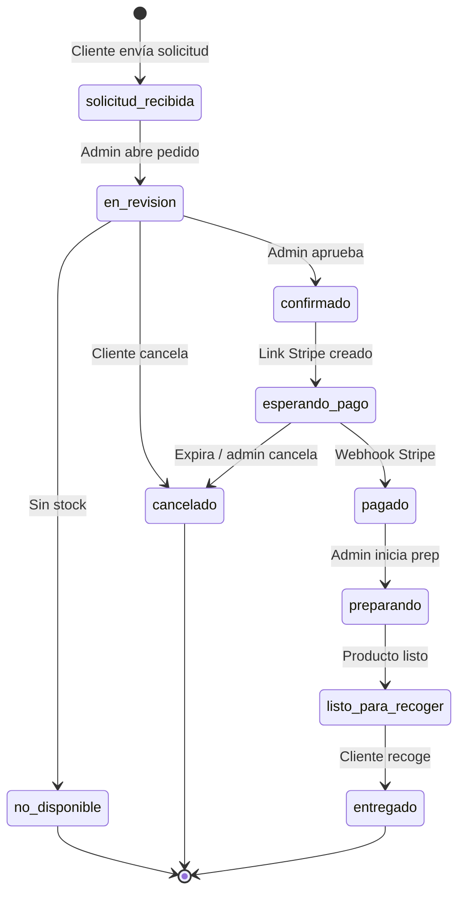

# RADIO SHALKO SALES OS — Plan maestro operativo

**Fase:** BUSINESS-1 / SALES-1  
**Proyecto:** Radio Shalko WEB (`/Users/cesargv/Desktop/Radio Shalko WEB`)  
**Fecha:** Junio 2026  
**Estado:** Documento oficial — **sin implementación**  
**Alcance:** Flujo de compra, aprobación humana, pago Stripe post-aprobación, recogida en tienda

> **Este documento reemplaza** cualquier estrategia anterior de ecommerce automático, envíos inmediatos, cobro antes de aprobación o Mercado Pago como pasarela principal.  
> **Principio rector:** el software se adapta a la operación real de Radio Shalko, no al revés.

---

## 1. Resumen ejecutivo

Radio Shalko WEB ya tiene un catálogo digital maduro, carrito unificado, checkout visual, creación de pedidos reales (`orders`, `order_items`) e inventario por sucursal (Chalco / Amecameca). Sin embargo, **el modelo de negocio no es ecommerce automático**: es un **Sales OS** donde el cliente **solicita una compra**, Radio Shalko **revisa disponibilidad física**, **aprueba** la solicitud, **genera un link de pago Stripe**, el cliente **paga**, y finalmente **recoge en tienda**.

Por ahora:
- **No hay envíos a domicilio.**
- **No hay cobro automático antes de aprobación admin.**
- **La compra requiere cuenta** (no pedidos anónimos).
- **Pickup en Chalco o Amecameca** es el único método de entrega activo.

La operación real incluye traslados Chalco/bodega → Amecameca al día siguiente. Por eso la aprobación humana es obligatoria, no opcional.

---

## 2. Flujo oficial aprobado

```
Cliente explora catálogo (sin login)
        ↓
Inicia sesión para comprar
        ↓
Arma carrito
        ↓
Checkout · solo recoger en tienda (Chalco / Amecameca)
        ↓
Envía SOLICITUD DE COMPRA (no paga)
        ↓
Pedido → solicitud_recibida / en_revision
        ↓
Admin revisa stock por sucursal + traslados posibles
        ↓
Admin APRUEBA (hoy / mañana / fecha / sucursal / nota)
        ↓
Sistema genera link Stripe
        ↓
Cliente paga
        ↓
Webhook Stripe confirma → pagado
        ↓
Admin prepara → listo para recoger
        ↓
Cliente recoge → entregado
```

---

## 3. Flujo cliente

### 3.1 Exploración (sin sesión)

El cliente puede:
- Navegar catálogo, marcas, categorías, PDP
- Agregar al carrito (hoy también funciona como invitado vía localStorage)
- Usar favoritos (requiere sesión)
- Solicitar asesoría por WhatsApp

**No puede completar una solicitud de compra sin sesión** (decisión BUSINESS-1).

### 3.2 Inicio de sesión obligatorio para comprar

Motivos:
- Historial de pedidos
- Datos de contacto verificables
- Trazabilidad operativa
- Evitar solicitudes huérfanas difíciles de gestionar

**Punto de fricción aceptado:** el login es requisito de negocio, no de UX genérica.

### 3.3 Carrito

Funciones:
- Ver productos, cantidades, subtotal estimado
- Modificar cantidades
- Ir a checkout
- Compartir carrito (canal asistido — no sustituye solicitud formal)
- Solicitar asesoría (WhatsApp)

El carrito **no es un pedido**. Sigue viviendo en `quotes` / `quote_items` (auth) o localStorage (invitado).

### 3.4 Checkout (futuro SALES-2)

**Activo:**
- Recoger en Chalco
- Recoger en Amecameca

**Desactivado (preparado para futuro, no visible):**
- Entrega local
- Envío nacional

**Copy del CTA (obligatorio):**
- ~~Finalizar compra~~ → **Enviar solicitud de compra**
- ~~Revisar y continuar~~ → **Confirmar solicitud**
- Mensaje claro: *Radio Shalko confirmará disponibilidad antes de enviarte el link de pago.*

**Sección de pago en checkout:** eliminar o convertir en informativa (*El pago se realizará después de confirmar disponibilidad*). No mostrar Mercado Pago / transferencia como si fueran activos hoy.

### 3.5 Confirmación al cliente

Tras enviar solicitud:
- Número de solicitud (`RS-YYYY-NNNNNN`)
- Mensaje: *Recibimos tu solicitud. Te contactaremos para confirmar disponibilidad.*
- Estado visible: **Solicitud recibida** / **En revisión**
- **Sin link de pago todavía**

### 3.6 Post-aprobación

Cuando admin aprueba:
- Cliente ve estado **Confirmado · Esperando pago**
- Recibe link Stripe (email + pantalla Mis pedidos)
- Instrucciones de recogida según sucursal y fecha acordada

### 3.7 Post-pago

- Estado **Pagado**
- Instrucciones: *Estamos preparando tu pedido*
- Cuando esté listo: **Listo para recoger** + sucursal + horario

---

## 4. Flujo administrador

### 4.1 Recepción de solicitud

Admin debe enterarse de un nuevo pedido vía (v1 recomendado):
1. **Panel admin** — lista de pendientes + badge contador
2. **Email interno** — a `eradioshalko@gmail.com` o alias operativo
3. *(Futuro)* WhatsApp interno / push

### 4.2 Revisión

En detalle del pedido, admin ve:
| Campo | Fuente |
|-------|--------|
| Cliente (nombre, email, teléfono) | `orders.customer_*` + perfil |
| Productos solicitados | `order_items` (snapshot) |
| Cantidades | `order_items.quantity` |
| Total estimado | `orders.total` |
| Sucursal elegida | `orders.branch_id` → Chalco / Amecameca |
| Notas del cliente | `orders.notes` |
| Stock interno por sucursal | `product_inventory` (solo admin) |
| Historial de estados | `order_status_history` |

### 4.3 Decisión de disponibilidad

Admin elige una de:
| Código | Significado |
|--------|-------------|
| **A** | Disponible hoy en sucursal seleccionada |
| **B** | Disponible mañana en sucursal seleccionada |
| **C** | Disponible en otra sucursal |
| **D** | No disponible |
| **E** | Sugerir alternativa (producto sustituto / cantidad menor) |

Campos adicionales al aprobar:
- Fecha de recogida (hoy / mañana / personalizada)
- Sucursal de entrega final (puede diferir de la solicitada)
- Nota interna
- Nota visible al cliente

### 4.4 Aprobación → pago

Tras aprobar:
1. Pedido pasa a `confirmado` + `esperando_pago`
2. Sistema crea Stripe Payment Link o Checkout Session
3. Se guarda `stripe_session_id` / `stripe_payment_link_url` en pedido
4. Cliente recibe notificación con link

**Admin no cobra manualmente en v1** salvo fallback operativo documentado.

### 4.5 Post-pago operativo

Cuando webhook confirma pago:
- `payment_status = paid`
- Admin ve pedido en **cola de preparación**
- Puede marcar: preparando → listo para recoger → entregado

### 4.6 Entrega en tienda

Al entregar:
- Admin marca **entregado**
- Pedido **cerrado**
- *(Futuro)* decremento de inventario en sucursal correspondiente

---

## 5. Flujo Chalco

**Contexto:** Chalco concentra tienda + bodega / stock principal.

| Escenario | Decisión típica |
|-----------|-----------------|
| Stock en Chalco ≥ cantidad | **Disponible hoy** |
| Stock en bodega Chalco, no en piso | **Disponible hoy** (preparar desde bodega) o en X horas |
| Stock insuficiente en Chalco | **No disponible** o **alternativa** |
| Solo existe en Amecameca | Ofrecer **recoger en Amecameca** o **trasladar mañana** |

**Regla operativa:** Chalco tiene mayor probabilidad de fulfillment mismo día.

---

## 6. Flujo Amecameca

**Contexto:** Amecameca depende de traslados matutinos desde Chalco/bodega.

| Escenario | Decisión típica |
|-----------|-----------------|
| Stock en Amecameca ≥ cantidad | **Disponible hoy** |
| Solo en Chalco/bodega | **Disponible mañana** (traslado matutino) |
| Stock parcial | Negociar cantidad o alternativa |
| Sin stock en ninguna sucursal | **No disponible** + sugerencia |

**Copy al cliente (ejemplo):**
> Tu pedido estará listo mañana en Amecameca. Lo trasladamos por la mañana desde nuestra bodega.

**Campo recomendado en pedido (futuro):** `requires_transfer` boolean + `transfer_from_branch_id`.

---

## 7. Estados oficiales recomendados

### 7.1 Análisis del modelo actual (ORDER-2 / ORDER-4)

**Tabla `orders` hoy:**

| Campo | Valores actuales | Alineación con Sales OS |
|-------|------------------|-------------------------|
| `status` | `pending`, `confirmed`, `cancelled`, `completed` | **Insuficiente** — mezcla solicitud, pago y cierre |
| `payment_status` | `unpaid`, `pending`, `paid`, `refunded`, `failed` | **Reutilizable** con ajustes semánticos |
| `fulfillment_status` | `unfulfilled`, `preparing`, `ready_for_pickup`, `shipped`, `delivered`, `cancelled` | **Mayormente reutilizable** — `shipped` queda para fase envíos |
| `delivery_method` | `pickup`, `local_delivery`, `national_shipping` | **Conservar enum** — desactivar local/national en UI |
| `payment_method` | `mercado_pago`, `bank_transfer`, `pay_in_store` | **Migrar** a Stripe-centric en SALES-6 |

**Estado inicial ORDER-4:** `pending` / `unpaid` / `unfulfilled` — funcional pero semánticamente genérico.

### 7.2 Propuesta: `orders.status` (ciclo de vida comercial)

| Estado | Label UI (cliente) | Label UI (admin) | Descripción |
|--------|-------------------|------------------|-------------|
| `solicitud_recibida` | Solicitud recibida | Nuevo | Cliente envió solicitud |
| `en_revision` | En revisión | Revisando | Admin está evaluando stock |
| `confirmado` | Confirmado | Aprobado | Disponibilidad confirmada, pendiente pago |
| `esperando_pago` | Esperando pago | Link enviado | Stripe link activo |
| `pagado` | Pagado | Pagado | Webhook Stripe OK |
| `preparando` | Preparando pedido | En preparación | Operación en tienda |
| `listo_para_recoger` | Listo para recoger | Listo | Cliente puede ir |
| `entregado` | Entregado | Entregado | Cerrado exitosamente |
| `cancelado` | Cancelado | Cancelado | Cancelado por cliente o admin |
| `no_disponible` | No disponible | No disponible | Productos no disponibles |

**Recomendación técnica:** migración SALES-3 que expanda el CHECK constraint y mapee `pending` existentes → `solicitud_recibida`.

### 7.3 `payment_status` (mantener enum, redefinir uso)

| Estado | Cuándo |
|--------|--------|
| `unpaid` | Solicitud recibida hasta aprobación |
| `pending` | Link Stripe generado, cliente no ha pagado |
| `paid` | Webhook Stripe `checkout.session.completed` / `payment_intent.succeeded` |
| `failed` | Pago fallido o expirado |
| `refunded` | Reembolso procesado |

### 7.4 `fulfillment_status` (mantener enum)

| Estado | Cuándo |
|--------|--------|
| `unfulfilled` | Antes de pago |
| `preparing` | Tras pago, en preparación |
| `ready_for_pickup` | Listo en mostrador |
| `delivered` | Entregado al cliente |
| `cancelled` | Cancelado |
| `shipped` | **Reservado** para SALES-10 (envíos) |

### 7.5 Campos nuevos recomendados (futuro, no implementar ahora)

| Campo | Tipo | Propósito |
|-------|------|-----------|
| `pickup_branch_id` | uuid | Sucursal final de recogida (puede ≠ branch solicitada) |
| `pickup_date` | date | Fecha acordada de recogida |
| `pickup_window` | text | Ej. "Hoy antes de las 18:00" |
| `admin_decision` | text | A / B / C / D / E |
| `admin_note_internal` | text | Nota solo admin |
| `admin_note_customer` | text | Nota visible al cliente |
| `requires_transfer` | boolean | Traslado Chalco → Amecameca |
| `stripe_session_id` | text | ID sesión Stripe |
| `stripe_payment_link_url` | text | URL de pago |
| `stripe_payment_intent_id` | text | Para reconciliación webhook |
| `approved_at` | timestamptz | Timestamp aprobación |
| `paid_at` | timestamptz | Timestamp pago confirmado |

### 7.6 Diagrama de transiciones



---

## 8. Inventario público vs interno

### 8.1 Principio de seguridad

La dueña **no quiere exponer cantidades exactas** por riesgo de revelar valor de almacén.

### 8.2 Qué ve el cliente (público)

| Señal | Condición | Copy |
|-------|-----------|------|
| **Disponible** | stock total > 0 | "Disponible" |
| **Consultar disponibilidad** | stock = 0 o sin filas de inventario | "Consultar disponibilidad" |
| **Bajo pedido** | flag futuro en producto | "Bajo pedido" |
| **No disponible** | producto despublicado o admin marca | "No disponible" |

**Nunca mostrar:** cantidades numéricas, stock por sucursal con números, totales de almacén.

**Estado actual del código:**
- `product-card.tsx` — ya usa Disponible / Consultar disponibilidad ✓
- `product-detail.tsx` — muestra por sucursal Disponible / Consultar (sin números) ✓
- **Ajustar:** copy en PDP menciona "envío a domicilio" — alinear en SALES-2
- **Correcto:** `orders/validators.ts` valida stock numérico en servidor sin exponerlo al cliente

### 8.3 Qué ve admin (interno)

| Vista | Detalle recomendado |
|-------|---------------------|
| Inventario admin | Cantidades por sucursal (ya existe `/admin/inventario`) |
| Detalle pedido | Stock Chalco / Amecameca por línea |
| Cola preparación | Indicador traslado pendiente |

**Precaución:** incluso en admin, evitar dashboards con valor total de inventario agregado visible sin control de rol.

### 8.4 Estrategia de validación en checkout

| Fase | Comportamiento |
|------|----------------|
| **Hoy (ORDER-4)** | Bloquea si stock total = 0 — demasiado estricto para Sales OS |
| **SALES-2+** | Permitir solicitud aunque stock = 0; admin decide en revisión |
| **Post-aprobación** | Reserva blanda (opcional SALES-4) sin decremento hasta entrega |

---

## 9. Estrategia de aprobación antes de pago

### 9.1 Regla de oro

> **Ningún peso se cobra antes de que un administrador confirme disponibilidad.**

### 9.2 Implicaciones

1. Checkout **no crea** Stripe session
2. Checkout **no muestra** pasarela de pago
3. `payment_status` permanece `unpaid` hasta aprobación
4. El total en solicitud es **estimado**; admin puede ajustar tras revisión (con nota al cliente)
5. `order_items` snapshot congela precio al momento de solicitud — cambios posteriores requieren nueva línea o nota

### 9.3 SLA operativo sugerido (decisión de negocio)

| Ventana | Objetivo |
|---------|----------|
| Horario tienda | Respuesta en < 2 horas |
| Fuera de horario | Respuesta siguiente día hábil |
| Urgente | WhatsApp directo (canal paralelo) |

---

## 10. Estrategia Stripe futura (SALES-6 / SALES-7)

### 10.1 Proveedor elegido

**Stripe** — Payment Link o Checkout Session (decisión pendiente, ver §16).

Mercado Pago queda **descartado** como pasarela principal en Sales OS.

### 10.2 Cuándo se crea el link

| Evento | Acción |
|--------|--------|
| Cliente envía solicitud | **No** crear Stripe |
| Admin aprueba | **Sí** crear Stripe con monto final |
| Admin rechaza | **No** crear Stripe |

### 10.3 Quién lo crea

Server Action `createStripePaymentForOrder(orderId)` — solo admin autenticado, validando que pedido esté en `confirmado`.

### 10.4 Datos a persistir

```
stripe_session_id
stripe_payment_link_url (si Payment Link)
stripe_payment_intent_id (post-webhook)
paid_at
```

### 10.5 Expiración

| Escenario | Acción |
|-----------|--------|
| Link expira (24–72 h configurable) | `payment_status = failed` o permanece `pending`; admin puede regenerar |
| Cliente no paga | Recordatorio email; tras N días → `cancelado` |

### 10.6 Webhook — fuente de verdad

```
POST /api/webhooks/stripe
  → verificar firma STRIPE_WEBHOOK_SECRET
  → evento checkout.session.completed / payment_intent.succeeded
  → idempotencia por event.id
  → UPDATE orders SET payment_status='paid', status='pagado', paid_at=now()
  → INSERT order_status_history
  → notificar admin + cliente
```

**El correo de Stripe NO es fuente de verdad.** Solo el webhook cambia estado a pagado.

### 10.7 Variables de entorno (Radio Shalko exclusivamente)

```
STRIPE_SECRET_KEY
STRIPE_WEBHOOK_SECRET
NEXT_PUBLIC_STRIPE_PUBLISHABLE_KEY (si Checkout embebido)
```

---

## 11. Notificaciones necesarias

### 11.1 Cliente

| Evento | Canal v1 | Canal futuro |
|--------|----------|--------------|
| Solicitud recibida | Email + pantalla confirmación | WhatsApp |
| En revisión | — (opcional) | — |
| Aprobado + link pago | Email + Mis pedidos | WhatsApp |
| Pago confirmado | Email + Mis pedidos | WhatsApp |
| Listo para recoger | Email + Mis pedidos | WhatsApp |
| No disponible / cancelado | Email | WhatsApp |

### 11.2 Admin

| Evento | Canal v1 | Canal futuro |
|--------|----------|--------------|
| Nueva solicitud | Email + badge panel | WhatsApp interno |
| Pago confirmado | Email + badge | Push |
| Pendiente preparar | Panel cola | — |
| Listo para entregar | Panel | — |

### 11.3 Decisión v1 recomendada

1. **Panel admin** con contador — obligatorio
2. **Email** vía Resend / SendGrid / Supabase Edge — recomendado
3. **WhatsApp automático** — SALES-5+ (no v1)

---

## 12. Pantallas futuras

### 12.1 Admin · Pedidos (`/admin/pedidos`)

**Lista:**
| Columna | Fuente |
|---------|--------|
| Número | `order_number` |
| Cliente | `customer_name` |
| Total | `total` |
| Sucursal | branch name |
| Estado | `status` |
| Pago | `payment_status` |
| Fecha | `created_at` |
| Acciones | Ver · Aprobar · Cancelar |

**Filtros:** pendientes · esperando pago · pagados · hoy · mañana

**Estado sidebar:** quitar `soon: true` en SALES-3

### 12.2 Admin · Detalle pedido (`/admin/pedidos/[id]`)

- Líneas con snapshot
- Stock interno por sucursal (Chalco / Amecameca)
- Formulario aprobación (decisión A–E, fecha, sucursal, notas)
- Botón generar link Stripe (post-aprobación)
- Timeline `order_status_history`
- Acciones: cancelar · marcar preparando · listo · entregado

### 12.3 Admin · Cola de preparación (`/admin/preparacion`)

| Columna | Descripción |
|---------|-------------|
| Pedido | order_number |
| Cliente | nombre |
| Recoger | hoy / mañana + fecha |
| Sucursal | Chalco / Amecameca |
| Traslado | sí / no |
| Estado | preparando / listo |

Vistas: **Recoger hoy** · **Recoger mañana** · **Trasladar a Amecameca** · **Listos**

### 12.4 Cliente · Mis pedidos (`/cuenta/pedidos`)

| Campo | Descripción |
|-------|-------------|
| Número | RS-YYYY-NNNNNN |
| Estado | label amigable |
| Total | monto |
| Sucursal | recogida |
| Pago | estado + botón pagar si aplica |
| Instrucciones | copy según estado |

Detalle: timeline, productos, nota admin, link Stripe si `esperando_pago`

---

## 13. Cambios necesarios al sistema actual

### 13.1 Qué se conserva

| Componente | Razón |
|------------|-------|
| `quotes` / `quote_items` como carrito | Separación carrito ≠ pedido |
| `orders` / `order_items` | Base sólida ORDER-2 |
| `order_status_history` | Auditoría |
| `customer_addresses` | Útil para SALES-10 envíos |
| `create_order_from_checkout` RPC | Adaptar payload, no reescribir |
| Inventario por sucursal | Core operación Chalco/Amecameca |
| Shared carts | Canal asistido paralelo |
| Checkout UI (ORDER-3.6 polish) | Base visual reutilizable |
| `order_number` RS-YYYY-NNNNNN | Identificador humano |

### 13.2 Qué debe ajustarse (por fase)

| Área | Estado actual | Cambio requerido | Fase |
|------|---------------|------------------|------|
| Checkout título | "Finalizar compra" | "Solicitar compra" | SALES-2 |
| CTA | "Revisar y continuar" | "Enviar solicitud" | SALES-2 |
| Entrega checkout | pickup + local + national activos | Solo pickup Chalco/Amecameca | SALES-2 |
| Sección pago checkout | Mercado Pago / transfer / tienda | Informativa o eliminada | SALES-2 |
| Login obligatorio | Invitados pueden crear pedido (ORDER-4) | Requerir sesión | SALES-2 |
| Estado inicial | `pending` | `solicitud_recibida` | SALES-3 |
| Validación stock checkout | Bloquea si stock = 0 | Permitir solicitud | SALES-2 |
| Confirmación | "Pedido confirmado" | "Solicitud recibida" | SALES-2 |
| `payment_method` enum | mercado_pago, etc. | stripe (+ pay_in_store fallback) | SALES-6 |
| Admin pedidos | `soon: true` | Módulo real | SALES-3 |
| PDP copy | menciona envío domicilio | pickup + solicitud | SALES-2 |
| ORDER_ARCHITECTURE doc | Mercado Pago centrado | **Superseded by this doc** | — |

### 13.3 Qué se deja preparado (sin activar)

- Enum `local_delivery` / `national_shipping` en BD
- Tabla `customer_addresses`
- `fulfillment_status.shipped`
- UI envíos oculta con feature flag

### 13.4 Qué NO implementar aún

- Stripe integration
- Webhooks
- Decremento automático inventario
- Envíos
- WhatsApp automático
- Facturación CFDI
- Reservas de stock automáticas

---

## 14. Roadmap exacto fase por fase

| Fase | Nombre | Entregable | Dependencias |
|------|--------|------------|--------------|
| **SALES-1** | Documento maestro | `RADIO_SHALKO_SALES_OS_PLAN.md` | — |
| **SALES-2** | Checkout solicitud pickup | UI + copy + login obligatorio + solo pickup + relajar validación stock | SALES-1 |
| **SALES-3** | Panel admin pedidos | `/admin/pedidos` lista + detalle básico + migración estados | SALES-2 |
| **SALES-4** | Aprobación disponibilidad | Formulario A–E, fecha, sucursal, notas, transiciones estado | SALES-3 |
| **SALES-5** | Notificaciones internas | Email admin + badge contador | SALES-3 |
| **SALES-6** | Stripe post-aprobación | Payment Link / Session + campos stripe_* | SALES-4 |
| **SALES-7** | Webhook Stripe | `/api/webhooks/stripe` + idempotencia + paid | SALES-6 |
| **SALES-8** | Cola preparación | `/admin/preparacion` + estados operativos | SALES-7 |
| **SALES-9** | Mis pedidos cliente | `/cuenta/pedidos` + link pago + timeline | SALES-7 |
| **SALES-10** | Envíos futuros | Activar local/national + direcciones + shipped | SALES-9 |

**Nota:** ORDER-5 (panel admin pedidos genérico) queda **absorbido** por SALES-3.

---

## 15. Riesgos

| Riesgo | Impacto | Mitigación |
|--------|---------|------------|
| Pedidos ORDER-4 con modelo antiguo | Estados inconsistentes | Migración `pending` → `solicitud_recibida` |
| Cliente espera pago inmediato | Confusión / abandono | Copy claro en checkout y confirmación |
| Admin no revisa a tiempo | Mala experiencia | SLA + email + badge |
| Doble pago Stripe | Pérdida financiera | Idempotencia webhook + un link activo por pedido |
| Stock oversell sin reserva | Cliente paga sin producto | Aprobación humana + reserva blanda post-pago |
| Exposición inventario | Seguridad negocio | Labels cualitativos públicos |
| Traslado Chalco→Amecameca no registrado | Cliente llega y no está | Campo `requires_transfer` + cola mañana |
| Invitados ORDER-4 en producción | Pedidos huérfanos | SALES-2 login obligatorio |
| Dependencia email Stripe | Estado desincronizado | Webhook como única fuente de verdad |
| Scope creep a ecommerce full | Retraso operación real | Este documento como gate de fases |

---

## 16. Decisiones pendientes

| # | Decisión | Opciones | Recomendación |
|---|----------|----------|---------------|
| 1 | Stripe: Payment Link vs Checkout Session | Link (simple) / Session (más control) | **Payment Link** para v1 |
| 2 | ¿Ajustar total post-aprobación? | Sí con nota / No | **Sí**, con confirmación cliente |
| 3 | ¿Permitir pago en tienda sin Stripe? | Sí / No | **Sí** como fallback manual (`pay_in_store`) |
| 4 | ¿Decrementar stock al pagar o al entregar? | Pagar / Entregar | **Al entregar** (SALES-8+) |
| 5 | Proveedor email transaccional | Resend / SendGrid / Supabase | Decidir en SALES-5 |
| 6 | SLA respuesta admin | 2h / 24h | Validar con operación |
| 7 | Expiración link Stripe | 24h / 48h / 72h | **48h** inicial |
| 8 | ¿Migrar `payment_method` enum ahora o en SALES-6? | SALES-2 / SALES-6 | **SALES-6** |
| 9 | ¿Un admin o múltiples roles? | Solo dueña / vendedores | Definir antes SALES-4 |
| 10 | WhatsApp automático | v1 / v2 | **v2+** |

---

## Apéndice A — Mapa de documentos

| Documento | Estado |
|-----------|--------|
| `ORDER_ARCHITECTURE_RADIO_SHALKO.md` | **Superseded** (Mercado Pago / ecommerce automático) |
| `ORDER-4_REPORT.md` | Válido técnicamente; flujo de negocio cambia en SALES-2 |
| `CHECKOUT_POLISH_REPORT.md` | Válido para UI; copy se ajustará en SALES-2 |
| **`RADIO_SHALKO_SALES_OS_PLAN.md`** | **Documento maestro vigente** |

---

## Apéndice B — Confirmación de aislamiento

Este plan fue elaborado **exclusivamente** para Radio Shalko WEB. No utiliza recursos, decisiones, MCP, credenciales ni contexto de SEEDIS ni de ningún otro proyecto.

---

*Fin del documento · BUSINESS-1 / SALES-1 · Solo documentación · Sin cambios de código*
