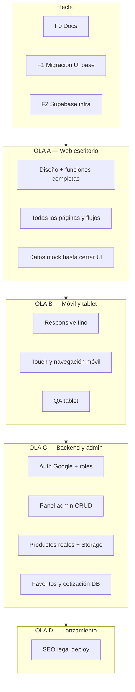
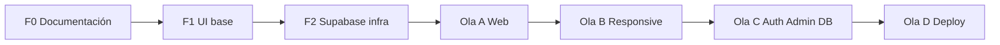

# Roadmap — Radio Shalko Web

**Producto:** Catálogo web profesional + panel administrativo (V1)  
**Stack:** Next.js 16 · TypeScript · Tailwind · Supabase · Vercel  
**Última actualización:** 20 de mayo de 2026  

**Documentos relacionados:** [PRD](./prd.md) · [Estado](./ESTADO_PROYECTO.md) · [Migración UI](./MIGRACION_UI.md) · [Supabase](./supabase/README.md)

---

## Visión y objetivo V1

Construir la plataforma web de **Radio Shalko** para:

- Exhibir productos con experiencia premium
- Buscar, filtrar y descubrir catálogo
- Favoritos y cotización **sin ecommerce** (sin pagos ni checkout)
- Administrar contenido desde `/admin`
- Escalar con Supabase + despliegue profesional

**Fuera de V1 (pausado):** ecommerce, app móvil admin, inventario avanzado, traspasos, SQLite offline.

---

## Estrategia de ejecución (orden acordado)

> **Principio:** primero una versión **web (escritorio) completa** en diseño y funciones; después **móvil y tablet**; al final **roles, admin y productos reales** en Supabase.

La base técnica (Next.js + Supabase infra) ya está. Lo que sigue es **pulir y completar la experiencia** antes de conectar backend y auth.



| Ola | Enfoque | Datos | Auth |
|-----|---------|-------|------|
| **A — Web escritorio** | Diseño, componentes, interacciones, páginas faltantes | Mock (`lib/products.ts`) | UI de login preparada, sin obligar aún |
| **B — Móvil + tablet** | Misma UI adaptada y optimizada | Mock | Igual |
| **C — Admin + real** | Roles, subir/editar productos, cambios en vivo | **Supabase** | **Google + admin** |
| **D — Producción** | SEO, legales, Vercel, Cloudflare | Supabase | Activo |

**Por qué este orden:** evita rehacer admin o migraciones de datos mientras el diseño y los flujos aún cambian. El catálogo mock permite iterar rápido en Cursor.

---

## Progreso global estimado

```
[██████░░░░░░░░░░░░░░] ~30 % hacia V1 “lista para producción”
```

| Área | Avance | Siguiente ola |
|------|--------|---------------|
| Documentación + setup técnico | 95 % | — |
| **Web escritorio (diseño + funciones)** | 50 % | **Ola A** ← estamos aquí |
| Móvil + tablet | 25 % | Ola B |
| Auth + roles + admin + DB | 10 % | Ola C |
| Producción (SEO, deploy) | 5 % | Ola D |

*La migración Lovable fue el punto de partida, no el producto terminado. Queda mucho por pulir.*

---

## Ola A — Web escritorio completa (PRIORIDAD ACTUAL)

**Objetivo:** En viewport **desktop (≥1024px)**, todas las páginas y funciones del PRD funcionando con datos mock, diseño premium y sin atajos visuales.

**Criterio de cierre:** un stakeholder puede recorrer todo el sitio en Chrome desktop y decir “esto está listo”; solo entonces pasamos a móvil/tablet.

### A.1 — Páginas y rutas faltantes

| ID | Entregable | Estado |
|----|------------|--------|
| A.1.1 | Detalle de producto `/productos/[slug]` | ⏳ |
| A.1.2 | Productos relacionados en detalle | ⏳ |
| A.1.3 | Estados vacíos (sin resultados, favoritos vacío) pulidos | ⏳ |
| A.1.4 | Páginas legales (privacidad, términos) — contenido placeholder pro | ⏳ |

### A.2 — Diseño y componentes (escritorio)

| ID | Entregable | Estado |
|----|------------|--------|
| A.2.1 | Header: mega menú productos/marcas refinado | 🔄 |
| A.2.2 | Buscador global (overlay, recientes, resultados) | 🔄 |
| A.2.3 | Sheets favoritos y cotización completos | 🔄 |
| A.2.4 | Home: hero, marcas, categorías, destacados — microanimaciones | 🔄 |
| A.2.5 | `/productos`: grid, filtros sidebar, orden, vistas lg/md/list | 🔄 |
| A.2.6 | `/marcas`: índice alfabético + secciones por marca | 🔄 |
| A.2.7 | `/servicios` y `/contacto` — layout y contenido final | 🔄 |
| A.2.8 | Footer newsletter y columnas — revisión visual | 🔄 |
| A.2.9 | Tipografía, espaciado, jerarquía (design QA desktop) | ⏳ |

### A.3 — Funciones con mock (sin Supabase aún)

| ID | Entregable | Estado |
|----|------------|--------|
| A.3.1 | Filtros productos (categoría, marca, precio) 100 % operativos | 🔄 |
| A.3.2 | Búsqueda enlazada a listado (`?q=`) | 🔄 |
| A.3.3 | Favoritos localStorage coherente en cards y páginas | 🔄 |
| A.3.4 | Cotización: agregar/quitar productos (estado local) | ⏳ |
| A.3.5 | Formulario contacto (validación + feedback UI) | ⏳ |
| A.3.6 | Navegación entre páginas coherente (breadcrumbs opcional) | ⏳ |

### A.4 — Panel admin (solo UI escritorio, mock)

| ID | Entregable | Estado |
|----|------------|--------|
| A.4.1 | Layout admin desktop pulido | 🔄 |
| A.4.2 | Formularios producto/categoría/marca (UI sin guardar DB) | ⏳ |
| A.4.3 | Tablas y acciones (editar/eliminar simulados) | ⏳ |

**Estimación Ola A:** 4–8 sesiones de trabajo enfocado.

---

## Ola B — Optimización móvil y tablet

**Objetivo:** Misma experiencia **completa y pulida** en phone y tablet, no solo “que no se rompa”.

**Criterio de cierre:** QA en iPhone + Android + iPad; menú móvil, filtros sheet, grids y tipografía validados.

| ID | Entregable | Prioridad |
|----|------------|-----------|
| B.1 | Header móvil: menú, búsqueda, iconos touch | Alta |
| B.2 | Hero y home sections en `svh` / móvil | Alta |
| B.3 | `/productos`: filtros en sheet, grid 2 cols, toolbar | Alta |
| B.4 | Cards producto: botones favoritos/cotizar accesibles | Alta |
| B.5 | Detalle producto mobile layout | Alta |
| B.6 | Footer apilado y legible | Media |
| B.7 | Tablet (768–1024): grids intermedios, mega menú | Media |
| B.8 | Performance scroll y animaciones en móvil | Media |
| B.9 | Accesibilidad touch (44px, contraste) | Media |

**Estimación Ola B:** 3–5 sesiones.

**Nota:** El PRD menciona prioridad móvil a largo plazo; en **esta estrategia** mobile se optimiza **después** de cerrar desktop, para no duplicar trabajo de diseño.

---

## Ola C — Roles, admin y productos reales (Supabase)

**Objetivo:** Admin entra con Google, sube productos reales, edita contenido; sitio público lee de la base de datos.

**Pre-requisitos:** Ola A + B cerradas (diseño y UX estables).

| ID | Entregable | Prioridad |
|----|------------|-----------|
| C.1 | Google OAuth en Supabase + redirect URLs | Alta |
| C.2 | Login/logout en header; middleware `/admin` | Alta |
| C.3 | Rol `admin` en `profiles` | Alta |
| C.4 | CRUD productos + imágenes Storage | Alta |
| C.5 | CRUD categorías, marcas, banners, servicios | Alta |
| C.6 | Sustituir mock → queries Supabase en sitio público | Alta |
| C.7 | Favoritos y cotización persistentes (usuario logueado) | Media |
| C.8 | Seed / carga productos reales Radio Shalko | Alta |
| C.9 | Panel admin responsive (hereda Ola B) | Media |

**Estimación Ola C:** 5–8 sesiones.

*Infra Supabase (Fase 2 técnica) ya está lista; esta ola es **integración**.*

---

## Ola D — SEO, legal y producción

**Objetivo:** Lanzamiento público estable.

| ID | Entregable | Prioridad |
|----|------------|-----------|
| D.1 | Metadata, OG, sitemap | Alta |
| D.2 | Privacidad, términos, cookies (textos finales) | Alta |
| D.3 | Deploy Vercel + env | Alta |
| D.4 | Cloudflare DNS/CDN | Media |
| D.5 | Lighthouse y ajustes finales | Media |

**Estimación Ola D:** 2–3 sesiones.

---

## Mapa técnico (referencia — fases infra ya hechas)



---

## Fase 0 — Fundamentos y documentación

**Estado:** ✅ Completada  
**Objetivo:** Alinear producto, stack y alcance V1.

| ID | Entregable | Estado |
|----|------------|--------|
| 0.1 | PRD V1 | ✅ |
| 0.2 | README | ✅ |
| 0.3 | ROADMAP (este documento) | ✅ |
| 0.4 | ESTADO_PROYECTO + MIGRACION_UI | ✅ |
| 0.5 | `.env.example` | ✅ |
| 0.6 | Checklist QA por página | ⏳ |

**Criterio de cierre:** equipo alineado en qué es V1 y qué no.

---

## Fase 1 — UI en Next.js (ex Lovable)

**Estado:** 🔄 Base migrada — **pulido en Ola A/B**  
**Objetivo:** Una sola app en Cursor; diseño Lovable migrado a Next.js (punto de partida, no versión final).

| ID | Entregable | Estado |
|----|------------|--------|
| 1.1 | Proyecto Next.js + Tailwind + estructura `src/` | ✅ |
| 1.2 | Assets en `public/images/` | ✅ |
| 1.3 | Design system (Fraunces, Inter, tokens copper) | ✅ |
| 1.4 | `SiteHeader` (nav, búsqueda, sheets) | ✅ |
| 1.5 | `Footer` | ✅ |
| 1.6 | Home: Hero, StoryStrip, Brands, Featured, Categories | ✅ |
| 1.7 | Páginas: productos, marcas, servicios, contacto, favoritos, garantía | ✅ |
| 1.8 | shadcn/ui mínimo (button, sheet, select, etc.) | ✅ |
| 1.9 | `responsive-web-design/` solo referencia (excluido del build) | ✅ |
| 1.10 | Pulido responsive / accesibilidad fina | ⏳ |

**Criterio de cierre:** `npm run dev` muestra el sitio completo con la UI de Lovable.

**Pendiente menor:** refinamiento visual, páginas legales placeholder → contenido real en Fase 7.

---

## Fase 2 — Supabase (backend base)

**Estado:** ✅ Completada (infra)  
**Objetivo:** Base de datos, RLS, storage y cliente en Next.js.

| ID | Entregable | Estado |
|----|------------|--------|
| 2.1 | Proyecto `actxvfjtejmpkjernvtw` | ✅ |
| 2.2 | Migración tablas (`profiles`, `products`, …) | ✅ |
| 2.3 | RLS: lectura pública catálogo, admin escribe | ✅ |
| 2.4 | Trigger `profiles` al registrarse | ✅ |
| 2.5 | Buckets Storage (`product-images`, `brand-logos`, `banners`) | ✅ |
| 2.6 | Seed categorías | ✅ |
| 2.7 | `.env.local` + tipos `database.generated.ts` | ✅ |
| 2.8 | Script `npm run db:migrate` | ✅ |
| 2.9 | Cliente browser/server/admin | ✅ |

**Criterio de cierre:** tablas visibles en Supabase Dashboard; app con variables configuradas.

**Nota:** La app **aún no consulta** productos desde la DB (eso es Fase 5).

---

## Fase 3 — Autenticación y roles

**Estado:** ⏳ Pendiente  
**Objetivo:** Login Google, perfiles, protección `/admin`, rol `admin` vs `user`.

| ID | Entregable | Prioridad |
|----|------------|-----------|
| 3.1 | Activar Google OAuth en Supabase Dashboard | Alta |
| 3.2 | Redirect URLs (`/auth/callback`, producción) | Alta |
| 3.3 | Botón login/logout en `SiteHeader` | Alta |
| 3.4 | Middleware: bloquear `/admin` sin sesión | Alta |
| 3.5 | Middleware o layout: solo `role=admin` en `/admin` | Alta |
| 3.6 | Crear primer usuario admin (SQL en `profiles`) | Alta |
| 3.7 | UI: estado de sesión (avatar / email) | Media |
| 3.8 | Página error auth | Baja |

**Dependencias:** Fase 2 ✅  

**Criterio de cierre:** usuario Google entra; admin accede a `/admin`; usuario normal no.

**Estimación:** 1–2 sesiones de desarrollo.

---

## Fase 4 — Panel administrativo

**Estado:** ⏳ Pendiente (shell existe)  
**Objetivo:** CRUD completo sin tocar código para contenido día a día.

| ID | Entregable | Prioridad |
|----|------------|-----------|
| 4.1 | Layout admin + navegación | ✅ shell |
| 4.2 | Dashboard con métricas reales (conteos Supabase) | Media |
| 4.3 | CRUD **Productos** (imágenes → Storage) | Alta |
| 4.4 | CRUD **Categorías** | Alta |
| 4.5 | CRUD **Marcas** (logo → Storage) | Alta |
| 4.6 | CRUD **Banners / Hero** | Media |
| 4.7 | CRUD **Servicios** | Media |
| 4.8 | Búsqueda y filtros en listados admin | Media |
| 4.9 | Validación formularios (zod + react-hook-form) | Media |
| 4.10 | Toasts / feedback (sonner) | Baja |

**Dependencias:** Fase 3 (admin autenticado)  

**Criterio de cierre:** publicar un producto en admin y verlo en `/productos`.

**Estimación:** 3–5 sesiones (productos es el más grande).

---

## Fase 5 — Catálogo dinámico (sitio público)

**Estado:** ⏳ Pendiente  
**Objetivo:** Sustituir mock por datos Supabase en todas las páginas públicas.

| ID | Entregable | Prioridad |
|----|------------|-----------|
| 5.1 | Capa `lib/data/products.ts` (queries + tipos) | Alta |
| 5.2 | `/productos` listado + filtros desde DB | Alta |
| 5.3 | Detalle producto `/productos/[slug]` | Alta |
| 5.4 | Productos relacionados | Media |
| 5.5 | Buscador header → query DB | Alta |
| 5.6 | `/marcas` dinámico | Media |
| 5.7 | Home: FeaturedProducts, Categories desde DB | Media |
| 5.8 | Home: Brands desde DB + logos Storage | Media |
| 5.9 | Banners / Hero desde tabla `banners` | Media |
| 5.10 | Servicios y contacto (contenido editable) | Baja |
| 5.11 | Eliminar o archivar `lib/products.ts` mock | Baja |
| 5.12 | Seed / import productos piloto (10–20 ítems) | Alta |

**Dependencias:** Fase 2 ✅; ideal con Fase 4 para cargar datos  

**Criterio de cierre:** cero datos hardcodeados en producción para catálogo.

**Estimación:** 2–4 sesiones.

---

## Fase 6 — Favoritos y cotización

**Estado:** ⏳ Pendiente  
**Objetivo:** Funciones de usuario autenticado sin checkout.

| ID | Entregable | Prioridad |
|----|------------|-----------|
| 6.1 | Tabla `favorites` en UI (requiere login) | Alta |
| 6.2 | Migrar `use-favorites` de localStorage → Supabase | Alta |
| 6.3 | Página `/favoritos` con datos reales | Alta |
| 6.4 | Modelo cotización (tabla `quote_items` o JSON + RPC) | Media |
| 6.5 | Sheet cotización en Header persistente | Media |
| 6.6 | Página `/cotizacion` + “solicitar información” | Media |
| 6.7 | Email / notificación interna (opcional V1) | Baja |

**Dependencias:** Fase 3 + Fase 5  

**Criterio de cierre:** usuario logueado guarda favoritos y arma cotización entre dispositivos.

**Estimación:** 2–3 sesiones.

---

## Fase 7 — SEO, legal, rendimiento y producción

**Estado:** ⏳ Pendiente  
**Objetivo:** Sitio listo para usuarios reales en producción.

| ID | Entregable | Prioridad |
|----|------------|-----------|
| 7.1 | Metadata + Open Graph por ruta | Alta |
| 7.2 | `sitemap.xml` + `robots.txt` | Media |
| 7.3 | `next/image` optimización imágenes | Media |
| 7.4 | Política privacidad, términos, cookies | Alta |
| 7.5 | Deploy **Vercel** (preview + production) | Alta |
| 7.6 | Variables env en Vercel | Alta |
| 7.7 | **Cloudflare** (DNS, CDN, WAF) | Media |
| 7.8 | Auditoría Lighthouse / móvil | Media |
| 7.9 | `error.tsx`, `not-found.tsx` branded | Baja |
| 7.10 | Monitoreo / analytics (opcional) | Baja |

**Dependencias:** Fases 3–6 estables  

**Criterio de cierre:** URL pública estable, legal publicado, métricas aceptables en móvil.

**Estimación:** 2–3 sesiones.

---

## Ruta crítica (orden acordado — resumen)

| Paso | Ola | Qué logras |
|------|-----|------------|
| **1** | **A — Web escritorio** | Todo el sitio + admin **se ve y funciona** en desktop (mock) |
| **2** | **B — Móvil + tablet** | Misma calidad en phone y iPad |
| **3** | **C — Auth + admin + DB** | Productos reales, roles, cambios desde panel |
| **4** | **D — Deploy** | Público en producción |

**Hito “listo para conectar backend”:** Ola A + B cerradas.  
**Hito “listo para negocio”:** Ola C (catálogo real + admin operativo).  
**Hito V1:** Ola D.

> Las fases técnicas 3–7 más abajo equivalen sobre todo a **Ola C** (auth, admin, datos) y **Ola D** (SEO/deploy).

---

## Backlog por página (checklist V1)

### Sitio público

| Página | UI base | Desktop pulido | Móvil/tablet | Datos DB |
|--------|---------|----------------|--------------|----------|
| `/` Home | ✅ | 🔄 | ⏳ | Ola C |
| `/productos` | ✅ | 🔄 | ⏳ | Ola C |
| `/productos/[slug]` | ⏳ | ⏳ | ⏳ | Ola C |
| `/marcas` | ✅ | 🔄 | ⏳ | Ola C |
| `/servicios` | ✅ | 🔄 | ⏳ | Ola C |
| `/contacto` | ✅ | 🔄 | ⏳ | Ola C |
| `/favoritos` | ✅ | 🔄 | ⏳ | Ola C |
| `/cotizacion` | 🔄 | ⏳ | ⏳ | Ola C |
| `/garantia` | ✅ | 🔄 | ⏳ | — |

### Admin

| Ruta | UI shell | UI desktop (mock) | CRUD Supabase |
|------|----------|-------------------|---------------|
| `/admin` | ✅ | ⏳ | Ola C |
| `/admin/productos` | ✅ | ⏳ | Ola C |
| `/admin/categorias` | ✅ | ⏳ | Ola C |
| `/admin/marcas` | ✅ | ⏳ | Ola C |
| `/admin/banners` | ✅ | ⏳ | Ola C |
| `/admin/servicios` | ✅ | ⏳ | Ola C |

---

## Infraestructura y cuentas (solo Radio Shalko)

| Recurso | Cuenta / proyecto | Estado |
|---------|-------------------|--------|
| Repositorio Git | `Radioshalko01-oss` | ✅ |
| Supabase | `actxvfjtejmpkjernvtw` | ✅ |
| Hosting | Vercel | ⏳ |
| CDN / DNS | Cloudflare | ⏳ |
| Auth | Google Cloud OAuth → Supabase | ⏳ |
| Lovable | Referencia histórica; desarrollo en Cursor | ✅ migrado |

**Regla:** no mezclar env, repos, Supabase ni MCP de otros proyectos en esta carpeta.

---

## V2 y más allá (fuera de roadmap actual)

| Idea | Notas |
|------|-------|
| Ecommerce (pagos, checkout, órdenes) | Requiere PRD V2 |
| App móvil administrativa | Pausado en PRD |
| Inventario avanzado / traspasos | Pausado |
| Multi-sucursal inventario en tiempo real | — |
| CRM / email marketing integrado | — |
| PWA offline | — |

---

## Cómo actualizar este roadmap

1. Al cerrar una fase, marcar entregables ✅ en la tabla correspondiente.  
2. Ajustar **Progreso global** de forma conservadora.  
3. Registrar fecha en **Historial** (abajo).  
4. Mantener [ESTADO_PROYECTO.md](./ESTADO_PROYECTO.md) sincronizado o apuntar solo a este archivo.

### Historial

| Fecha | Cambio |
|-------|--------|
| 2026-05-20 | Creación del roadmap. F0–F2 completadas; F1 UI migrada; Supabase infra lista. |
| 2026-05-20 | **Estrategia revisada:** Ola A (web desktop) → Ola B (móvil/tablet) → Ola C (auth/admin/DB) → Ola D (deploy). |
| | **Prioridad actual:** Ola A — pulir diseño y funciones en escritorio con mock. |

---

*Roadmap vivo para Radio Shalko Web V1. Fuente de verdad funcional: [prd.md](./prd.md).*
